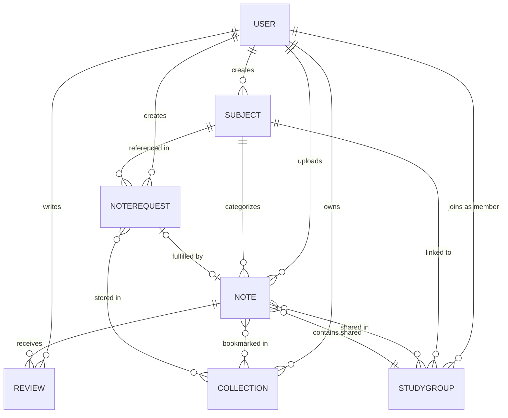

# UniVault Database Schema Diagram

This diagram shows all MongoDB collections (tables) and their relationships in the UniVault system.



---

## Database Models Explained

### 1. **USER** – Student Accounts
| Field | Type | Purpose |
|-------|------|---------|
| `_id` | ObjectId | Primary key |
| `name` | String | Student name |
| `email` | String | Unique email |
| `password` | String | Hashed password |
| `avatar` | String | Profile picture URL (Cloudinary) |
| `university` | String | University name |
| `batch` | String | Year/batch (e.g., "SE2020") |
| `role` | String | "student" or "admin" |
| `isActive` | Boolean | Account active/banned status |
| `isEmailVerified` | Boolean | Email verification flag |

---

### 2. **SUBJECT** – Courses/Topics
| Field | Type | Purpose |
|-------|------|---------|
| `_id` | ObjectId | Primary key |
| `name` | String | Subject name (e.g., "Data Structures") |
| `code` | String | Course code (e.g., "CS3012") |
| `department` | String | Department (e.g., "Faculty of Computing") |
| `semester` | Number | Semester (1-12) |
| `description` | String | Subject description |
| `createdBy` | ObjectId | Reference to User who created it |

---

### 3. **NOTE** – Study Material
| Field | Type | Purpose |
|-------|------|---------|
| `_id` | ObjectId | Primary key |
| `title` | String | Note title |
| `description` | String | Note description/summary |
| `fileUrl` | String | URL to file (Cloudinary/GridFS) |
| `fileId` | ObjectId | MongoDB GridFS file ID |
| `fileType` | String | "pdf", "image", "doc", "docx" |
| `fileSize` | Number | File size in bytes |
| `subject` | ObjectId → Subject | Which subject does it belong to |
| `uploadedBy` | ObjectId → User | Who uploaded this note |
| `averageRating` | Number | Average review rating (1-5) |
| `totalReviews` | Number | Count of reviews |
| `isPublic` | Boolean | Public or private note |
| `tags` | Array | Search tags (e.g., ["midterm", "exam"]) |
| `viewCount` | Number | How many times viewed |

---

### 4. **REVIEW** – Ratings & Feedback
| Field | Type | Purpose |
|-------|------|---------|
| `_id` | ObjectId | Primary key |
| `note` | ObjectId → Note | Which note is reviewed |
| `reviewer` | ObjectId → User | Who wrote the review |
| `rating` | Number | 1-5 star rating |
| `comment` | String | Review text (max 1000 chars) |
| `isHidden` | Boolean | Hidden or visible |
| `isEdited` | Boolean | Review was edited |
| `helpfulVotesCount` | Number | "Helpful" votes |
| `notHelpfulVotesCount` | Number | "Not helpful" votes |
| `votes` | Array | [{user, value}] – User votes |
| `reports` | Array | [{reporter, reason, reportedAt}] – Report records |
| `createdAt` | Date | When review was created |

---

### 5. **COLLECTION** – Bookmarked Folders
| Field | Type | Purpose |
|-------|------|---------|
| `_id` | ObjectId | Primary key |
| `name` | String | Collection name (e.g., "Midterm Prep") |
| `description` | String | Collection description |
| `owner` | ObjectId → User | Who owns this collection |
| `notes` | Array [ObjectId] | Bookmarked notes |
| `requestFulfillments` | Array [ObjectId] | Stored request fulfillments |
| `isPrivate` | Boolean | Private or public collection |

---

### 6. **NOTEREQUEST** – Community Requests
| Field | Type | Purpose |
|-------|------|---------|
| `_id` | ObjectId | Primary key |
| `title` | String | What notes are needed |
| `description` | String | Request details |
| `subject` | ObjectId → Subject | Related subject |
| `requestedBy` | ObjectId → User | Who asked |
| `status` | String | "open", "fulfilled", "closed" |
| `fulfilledByNote` | ObjectId → Note | Which note fulfilled it (if any) |
| `fulfillment` | Object | {fileId, fileName, uploadedBy, isPublic} |
| `priority` | String | "low", "medium", "high" |
| `dueDate` | Date | When the request expires |

---

### 7. **STUDYGROUP** – Collaborative Groups
| Field | Type | Purpose |
|-------|------|---------|
| `_id` | ObjectId | Primary key |
| `name` | String | Group name |
| `description` | String | Group purpose |
| `subject` | ObjectId → Subject | Subject the group focuses on |
| `members` | Array | [{user: ObjectId, role, joinedAt}] – Group membership |
| `joinRequests` | Array | [{user, status, requestedAt}] – Permission requests |
| `sharedNotes` | Array [ObjectId] | Notes shared in the group |
| `coverImage` | String | Group avatar/cover |
| `invitationCode` | String | Code to join the group |
| `privacy` | String | "public", "private", "protected" |
| `createdBy` | ObjectId → User | Group creator |
| `createdAt` | Date | Group creation date |

---

## Data Flow Examples

### Example 1: Upload & Share a Note
```
1. Student (User) uploads a PDF
   → File stored in MongoDB GridFS
   → Note document created with fileId, uploadedBy, subject
   → Other students can search and find the note

2. Students rate the note
   → Review documents created, linked to the Note
   → averageRating and totalReviews updated on Note
```

### Example 2: Request & Fulfillment
```
1. Student posts a NoteRequest
   → "I need notes on Database Indexing"
   → NoteRequest created with status = "open"

2. Another student finds/uploads notes that match
   → Calls POST /api/requests/:id/fulfill with their Note
   → NoteRequest.fulfilledByNote = Note._id
   → NoteRequest.status = "fulfilled"

3. Requester bookmarks the fulfillment
   → Note added to their Collection
   → OR NoteRequest added to Collection
```

### Example 3: Study Group Collaboration
```
1. Student creates a StudyGroup for "Data Structures"
   → StudyGroup.name = "Data Structures Study Circle"
   → StudyGroup.subject = Subject._id
   → StudyGroup.members = [{ user: creatorId, role: "admin" }]

2. Members share notes in the group
   → Notes added to StudyGroup.sharedNotes
   → Real-time updates via Socket.IO

3. Group chat & messages
   → Messages stored in StudyGroup.messages subdocument
   → Broadcasted via Socket.IO to group members
```

---

## How to View the Diagram in VS Code

### Step 1: Open the File
- In VS Code, open `Database_Schema_Diagram.md`
- Make sure you have the Markdown Preview extension (built-in)

### Step 2: Open Markdown Preview
- **Option A:** Press `Ctrl+Shift+V` (opens in a new tab)
- **Option B:** Run `Markdown: Open Preview` from the Command Palette (`Ctrl+Shift+P`)
- **Option C:** Click the preview icon in the top-right of the editor

### Step 3: View the Diagram
- The ER (Entity-Relationship) diagram should render automatically
- It shows all tables and their connections

### Step 4: Adjust for Better Visibility
- If the diagram is too small, zoom in with `Ctrl+Scroll` or `Ctrl++`
- If it doesn't fit the screen, zoom out with `Ctrl+-`
- For side-by-side view, use `Ctrl+K V` instead of `Ctrl+Shift+V`

---

## How to Export for Your Report

### Export as JPG Screenshot

1. Open `Database_Schema_Diagram.md` and open Markdown Preview (`Ctrl+Shift+V`)
2. Hide the file explorer (Ctrl+B) to maximize diagram width
3. Set preview zoom to 110–125% for readable text
4. Take a screenshot of the ER diagram section only
5. Save the screenshot as `Database_Schema_Diagram.jpg`
6. Insert into your report as an image

### Export as PDF

**Option 1: Print from Preview**
1. Open Markdown Preview
2. Press `Ctrl+P` to open the print dialog
3. Choose "Save as PDF" instead of printing to paper
4. Save as `Database_Schema_Diagram.pdf`

**Option 2: Screenshot → PDF tool**
1. Take a screenshot of the preview
2. Use an online tool (e.g., JPEG to PDF converter) or drag into a PDF editor
3. Save and insert into your report

---

## Tips for Clear Screenshots

✅ **DO:**
- Hide the file tree and VS Code sidebar before capturing
- Maximize the preview window to give the diagram more space
- Zoom preview to 110–125% so text is readable
- Crop the screenshot tightly around the diagram (no white space)
- Use high-contrast theme in VS Code for better visibility

❌ **DON'T:**
- Screenshot while the editor is still in focus
- Use zoom below 100% – text will be too small
- Leave the full VS Code window in the screenshot – focus on the preview

---

## Database Relationship Summary

| From | To | Relationship | Meaning |
|------|----|----|---------|
| User | Note | 1 → Many | One user can upload many notes |
| User | Review | 1 → Many | One user can write many reviews |
| User | Collection | 1 → Many | One user can own many collections |
| User | StudyGroup | Many → Many | Users can join many groups; groups have many users |
| Subject | Note | 1 → Many | One subject has many notes |
| Subject | StudyGroup | 1 → Many | One subject can have many study groups |
| Note | Review | 1 → Many | One note can have many reviews |
| Note | Collection | Many → Many | Notes can be in many collections; collections have many notes |
| NoteRequest | Note | 0 → 1 | A request can be fulfilled by zero or one note |

---

## Next Steps

1. ✅ View the ER diagram in Markdown Preview
2. 📸 Take a screenshot at 110–125% zoom
3. 📄 Export as JPG or PDF
4. 📋 Insert into your report with a caption like:
   > *Figure X: UniVault Database Schema showing 7 core MongoDB collections and their relationships*
5. ✨ Done!

---

## Questions About the Schema?

- **Why MongoDB and not SQL?** – NoSQL allows flexible schema for embedded arrays like `members[]` in groups and `votes[]` in reviews; better for rapid prototyping.
- **What about GridFS for files?** – Notes and request fulfillments use MongoDB GridFS to store large files (PDFs, images) without needing a separate S3 bucket (for this project scope).
- **Are there indexes?** – Yes! Backend has 5+ indexes on Review, Note, and StudyGroup for fast searching, filtering by subject, rating aggregation, etc.
