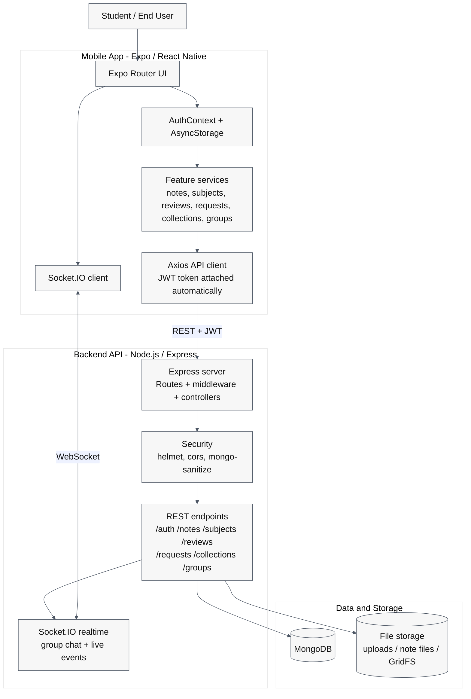

# UniVault System Architecture Diagram

This diagram reflects the current mobile app, backend API, storage, and realtime layers in UniVault.

## How to view it in VS Code

1. Open `system-architecture-diagram.md` in VS Code.
2. Press `Ctrl+Shift+V` to open Markdown Preview, or run `Markdown: Open Preview` from the Command Palette.
3. Use `Ctrl+Shift+V` for a full preview tab.
4. Set the preview zoom to 125% or 150% before exporting so the text stays readable in JPG/PDF.
5. The Mermaid diagram should render automatically because the code block starts with `mermaid`.

## Best Screenshot Result

1. Open the preview in its own tab so the diagram has maximum height.
2. Hide the file tree and any side panels before taking the screenshot.
3. Use the browser or preview zoom at 150% if you want the labels to stay readable after export.
4. If you still cannot fit it on one screen, reduce the VS Code zoom with Ctrl+- once, then screenshot the preview only.
5. For a PDF, print the preview page; for a JPG, capture the preview and crop the border tightly.

## How to use it in your report

1. If your report supports Markdown, paste the whole Mermaid block directly.
2. If your report needs an image, open the preview and take a screenshot of the rendered diagram.
3. If you want, I can also turn this into a cleaner PDF-style version or make it more detailed for an academic report.